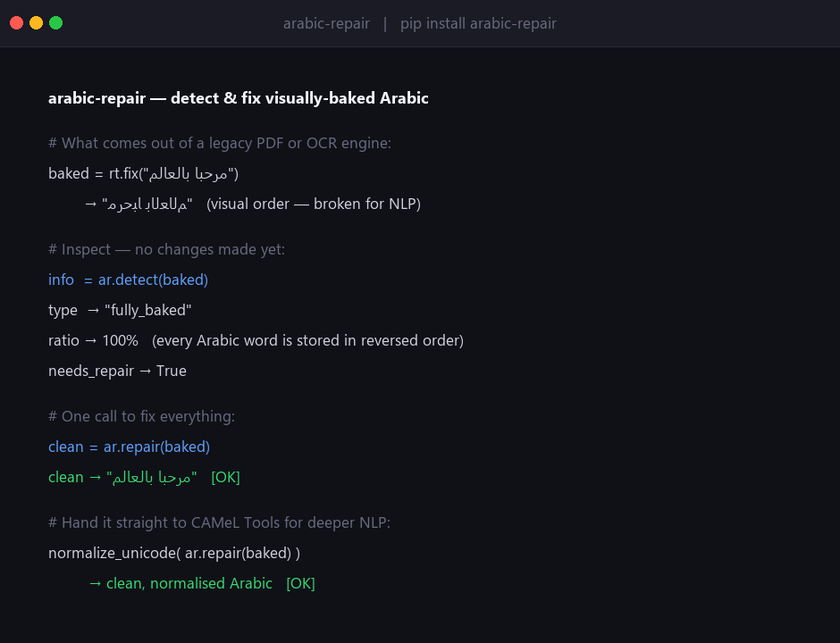

# arabic-repair

**Detect and repair visually-baked Arabic text from PDFs, OCR engines, and legacy sources.**

[](https://pypi.org/project/arabic-repair/)
[](https://pypi.org/project/arabic-repair/)
[](LICENSE)
[](https://huggingface.co/spaces/balswyan/arabic-rt)

**[🤗 Live demo](https://huggingface.co/spaces/balswyan/arabic-rt)** · **[📖 Article](https://huggingface.co/spaces/balswyan/arabic-nlp)** · **[📦 PyPI](https://pypi.org/project/arabic-repair/)**



## The problem

Arabic text from PDFs, OCR engines, and legacy systems is stored in **visual order** with
**presentation-form characters** (Unicode U+FB50–U+FEFF). NFKC normalization removes the
presentation forms but **cannot restore the reversed word order** — the text stays scrambled.

This means a −73% drop in retrieval recall for Arabic RAG systems and a +253% increase in
tokenizer cost — even after running NFKC or CAMeL Tools.
([Benchmark →](https://github.com/balswyan/arabic-benchmark))

`arabic-repair` fixes both: de-shapes the presentation forms *and* restores logical word order.

## Install

```bash
pip install arabic-repair
```

## Quick start

```python
import arabic_repair as ar

# Inspect before touching anything
info = ar.detect(raw_text)
print(info.contamination_type)   # "fully_baked" | "partially_baked" | "clean"
print(info.contaminated_ratio)   # 0.0 – 1.0
print(info.needs_repair)         # True / False

# Repair in one call
clean = ar.repair(raw_text)

# Chain into CAMeL Tools for full linguistic normalization
from camel_tools.utils.normalize import normalize_unicode
fully_clean = normalize_unicode(ar.repair(raw_text))

# Stream large documents without loading everything into memory
with open("extracted.txt", encoding="utf-8") as f:
    for line in ar.repair_stream(f):
        process(line)
```

## What it fixes vs what it doesn't

| | arabic-repair | NFKC | CAMeL Tools |
|---|:---:|:---:|:---:|
| Presentation forms → base letters | ✓ | ✓ | ✓ |
| **Visual order → logical order** | **✓** | **✗** | **✗** |
| Alef variant normalization | ✗ | ✗ | ✓ |
| Yaa / teh-marbuta normalization | ✗ | ✗ | ✓ |
| Diacritics / linguistic normalization | ✗ | ✗ | ✓ |

Use `arabic-repair` **before** CAMeL Tools, not instead of it. We fix what NFKC can't;
CAMeL Tools handles the linguistics.

## Ecosystem

| Package | Purpose |
|---|---|
| **arabic-rt** | Core engine: shape / fix / unfix. Also for [.NET & Unity](https://github.com/balswyan/arabic-rt-dotnet). |
| **arabic-repair** ← you are here | Detect + repair visual-order contamination. |
| [arabic-extract](https://github.com/balswyan/arabic-extract) | End-to-end PDF + image extraction pipeline. |
| [arabic-benchmark](https://github.com/balswyan/arabic-benchmark) | Benchmark proving the reordering gap. |

## License

MPL-2.0 — by Bandar AlSwyan
